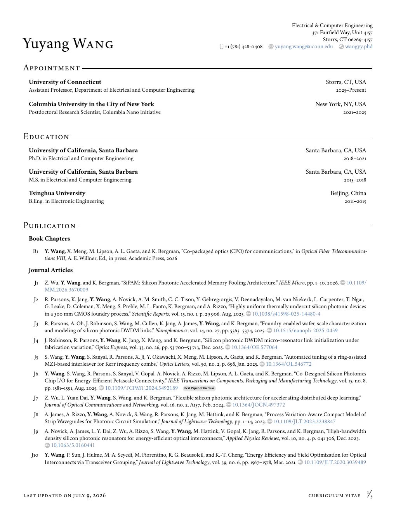

# Yuyang Wang CV

Source files for building the main curriculum vitae.



## Build

```sh
make all
```

The build writes auxiliary files to `.cache/` and copies the generated CV to `cv_yw.pdf`.

## Files

- `cv_yw.tex` is the main CV source.
- `papers.bib` is the curated bibliography used by the CV.
- `wilcv.sty` contains the CV styling macros.
